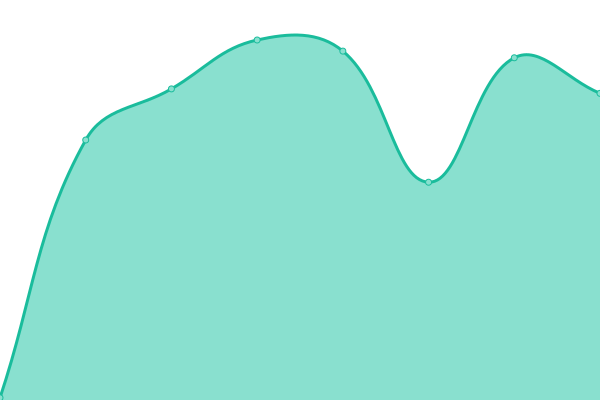
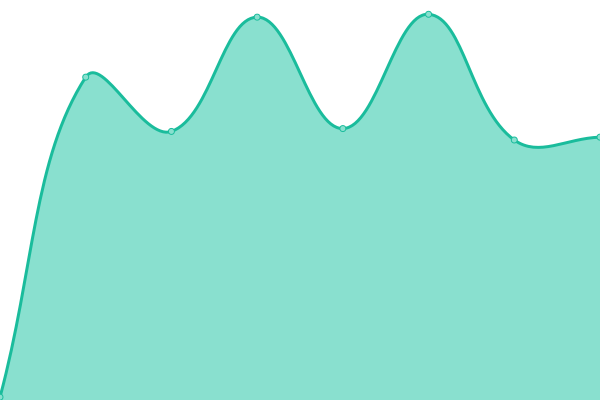
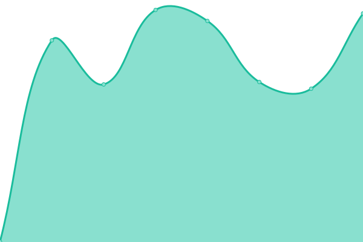
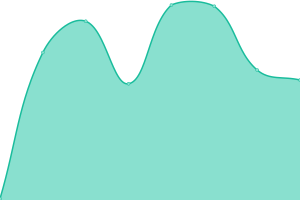
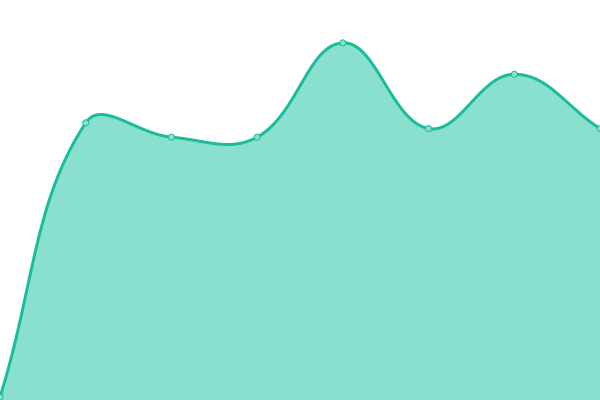

# [📈 Live Status](https://status.neverkin.com/): <!--live status--> **🟩 All systems operational**

This repository contains the uptime monitor and status page for [Neverkin](https://neverkin.com) — the collaborative worldbuilding platform for writers, game masters, and creators. Powered by [Upptime](https://github.com/upptime/upptime).

Organize timelines, characters, lore, and interconnected stories — all in real-time with your friends. We use [Issues](https://github.com/tenebrie/neverkin-status/issues) as incident reports, [Actions](https://github.com/tenebrie/neverkin-status/actions) as uptime monitors, and [Pages](https://status.neverkin.com) for the status page.

<!--start: status pages-->
<!-- This summary is generated by Upptime (https://github.com/upptime/upptime) -->
<!-- Do not edit this manually, your changes will be overwritten -->
<!-- prettier-ignore -->
| URL | Status | History | Response Time | Uptime |
| --- | ------ | ------- | ------------- | ------ |
|  [Landing Page](https://neverkin.com) | 🟩 Up | [landing-page.yml](https://github.com/Tenebrie/neverkin-status/commits/HEAD/history/landing-page.yml) | 

 627ms
     
 | 

<a href="https://status.neverkin.com/history/landing-page">100.00%</a>
    

|  [App Frontend](https://app.neverkin.com) | 🟩 Up | [app-frontend.yml](https://github.com/Tenebrie/neverkin-status/commits/HEAD/history/app-frontend.yml) | 

 428ms
     
 | 

<a href="https://status.neverkin.com/history/app-frontend">100.00%</a>
    

|  [Rest API](https://app.neverkin.com/api/health) | 🟩 Up | [rest-api.yml](https://github.com/Tenebrie/neverkin-status/commits/HEAD/history/rest-api.yml) | 

 117ms
     
 | 

<a href="https://status.neverkin.com/history/rest-api">100.00%</a>
    

|  [Websockets](https://app.neverkin.com/calliope/health) | 🟩 Up | [websockets.yml](https://github.com/Tenebrie/neverkin-status/commits/HEAD/history/websockets.yml) | 

 115ms
     
 | 

<a href="https://status.neverkin.com/history/websockets">100.00%</a>
    

|  [MCP Server](https://app.neverkin.com/orpheus/health) | 🟩 Up | [mcp-server.yml](https://github.com/Tenebrie/neverkin-status/commits/HEAD/history/mcp-server.yml) | 

 115ms
     
 | 

<a href="https://status.neverkin.com/history/mcp-server">100.00%</a>
    

|  [Landing Page (Staging)](https://staging.neverkin.com) | 🟩 Up | [landing-page-staging.yml](https://github.com/Tenebrie/neverkin-status/commits/HEAD/history/landing-page-staging.yml) | 

 665ms
     
 | 

<a href="https://status.neverkin.com/history/landing-page-staging">100.00%</a>
    

|  [App Frontend (Staging)](https://app.staging.neverkin.com) | 🟩 Up | [app-frontend-staging.yml](https://github.com/Tenebrie/neverkin-status/commits/HEAD/history/app-frontend-staging.yml) | 

 433ms
     
 | 

<a href="https://status.neverkin.com/history/app-frontend-staging">100.00%</a>
    

|  [Rest API (Staging)](https://app.staging.neverkin.com/api/health) | 🟩 Up | [rest-api-staging.yml](https://github.com/Tenebrie/neverkin-status/commits/HEAD/history/rest-api-staging.yml) | 

 112ms
     
 | 

<a href="https://status.neverkin.com/history/rest-api-staging">100.00%</a>
    

|  [Websockets (Staging)](https://app.staging.neverkin.com/calliope/health) | 🟩 Up | [websockets-staging.yml](https://github.com/Tenebrie/neverkin-status/commits/HEAD/history/websockets-staging.yml) | 

 113ms
     
 | 

<a href="https://status.neverkin.com/history/websockets-staging">100.00%</a>
    

|  [MCP Server (Staging)](https://app.staging.neverkin.com/orpheus/health) | 🟩 Up | [mcp-server-staging.yml](https://github.com/Tenebrie/neverkin-status/commits/HEAD/history/mcp-server-staging.yml) | 

 112ms
     
 | 

<a href="https://status.neverkin.com/history/mcp-server-staging">100.00%</a>
    

<!--end: status pages-->

[**Visit the Neverkin status page →**](https://status.neverkin.com/)

## 📄 License

- Powered by: [Upptime](https://github.com/upptime/upptime)
- Code: [MIT](./LICENSE) © [Anand Chowdhary](https://anandchowdhary.com), supported by [Pabio](https://pabio.com)
- Neverkin: [GPL-3.0](https://github.com/tenebrie/timelines/blob/master/LICENSE)
